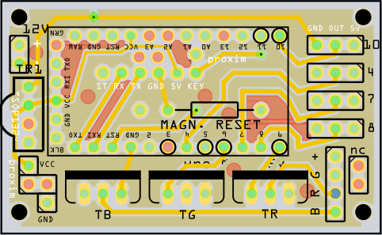

OturmaOdasi
===========

Arduino sketch to control an RGB LED strip and several lamps via IR and Bluetooth for a ceiling lamp project.

In the "schematic" folder there is a Fritzing project for a PCB that will host an Arduino Pro Mini that 
connects to an TSOP IR receiver as well as a Bluetooth module and controls up to four relays and a RGB strip.
The relays are not contained on the PCB but can be connected to the pin headers. 

The sketch and the PCB are designed for over-the-air programming via Bluetooth. For this purpose, one of the
pins ofthe Arduino connects back to its reset pin. You need a patched version of the avrdude binary contained
in the Arduino toolchain that can be found <a href="avrdude/avrdude-5.11.patch">here</a>.

The patched version sends an ESC character to force a reset of the Arduino a few milli seconds before the 
programming process starts. However, the PCB board contains also a reed contact to allow a reset of the 
Arduino with a strong magnet withou removing the board from the target device.

This allows a reset of the board after an upload failed and the sketch stopped to communicate properly via
Bluetooth.

